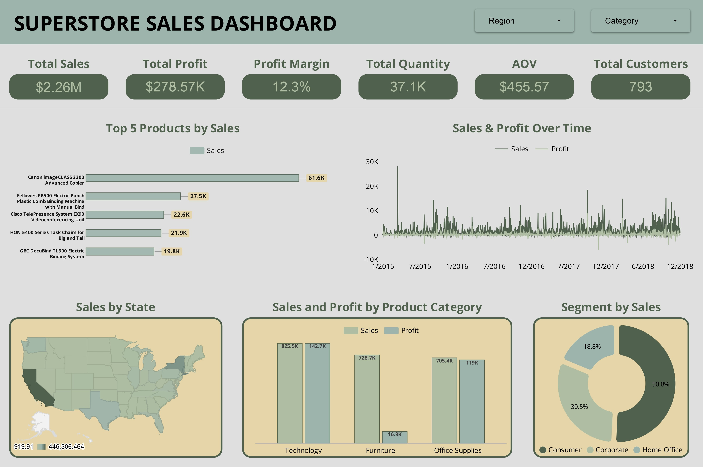

# Superstore Sales Dashboard

### Interactive Dashboard Preview
This dashboard provides a comprehensive overview of the Superstore's sales performance. The key metrics and visualizations are designed to offer actionable insights at a glance.

  

---

### Project Overview
The goal of this project is to analyze the Superstore dataset to identify key trends, top-performing products, and profitable segments. By consolidating various metrics into a single interactive view, this dashboard serves as a strategic tool for business decision-making, helping to understand sales distribution, profitability, and customer behavior.

---

### Dashboard Key Performance Indicators (KPIs)

| Metric | Value |
| :--- | :--- |
| **Total Sales**  | $2.26M |
| **Total Profit**  | $278.57K |
| **Profit Margin**  | 12.3% |
| **Total Quantity Sold**  | 37.1K |
| **Average Order Value (AOV)**  | $455.57 |
| **Total Customers**  | 793 |

---

### Key Insights & Visualizations

#### 1. Profitability by Product Category
The analysis of product categories reveals significant differences in profitability.
* **Technology** is the most profitable category, generating **$142.7K in profit** from $825.5K in sales.
* **Furniture**, despite having high sales of **$728.7K**, has a very low profit of only **$16.9K**.
* **Office Supplies** remains a healthy category with **$119K in profit** from $705.4K in sales.

#### 2. Top Performing Products
A few key products drive a significant portion of sales. 
* The **Canon imageCLASS 2200 Advanced Copier** is the top-selling product by a large margin, with sales of **$61.6K**. 
* The top 5 products are dominated by high-value items such as electronics and office machines. 

#### 3. Sales Distribution by Customer Segment
The customer base is primarily driven by the Consumer segment.
* **Consumer** segment accounts for **50.8%** of total sales.
* **Corporate** segment is the second largest, contributing **30.5%** of sales. 
* **Home Office** makes up the remaining **18.8%**.

#### 4. Geographic & Time-Series Performance
* **Geographic Sales:** The map visualization indicates that sales are heavily concentrated in key states, with California being a top performer.
* **Sales & Profit Trends:** The time-series chart shows sales and profit fluctuations from 2015 to the end of 2018, highlighting seasonal trends and business growth over the period. 
